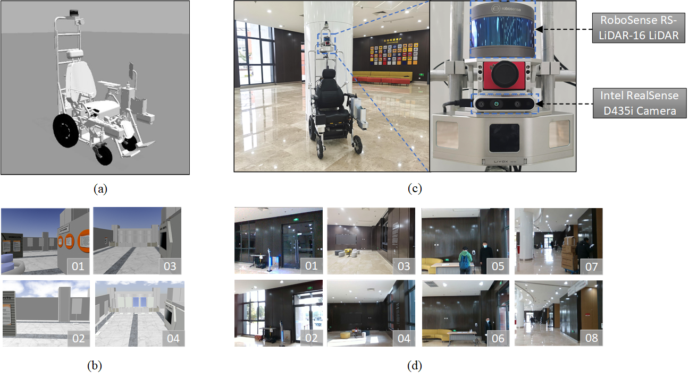

# Long-Term Visual SLAM With Bayesian Persistence Filter Based Global Map Prediction
We propose a novel long-term SLAM system with global map prediction and dynamics removal based on the Bayesian persistence filter. Extensive experiments are carried out on a wheelchair robot in an indoor dynamic environment over several months.
We collect our own real-world long-term datasets and we opensource it on github.

